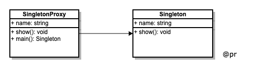

# 为什么使用单体模式
在回答这个问题之前，先说下什么是单例模式。
单例模式又叫单体模式，保证一个类仅有一个实例，这意味着第二次使用同一个类创建新对象时，得到的是与第一次所创建的对象完全相同，并提供全局访问点。

## 与全局变量的是非
抓住关键词 “唯一” 和 “全局访问” 的对象，不经让我想起**全局对象**。
```js
// 全局对象
var globaObj = {};
```

**but，使用全局变量会有以下问题：**
- 命名空间污染（变量名冲突）
- 维护时不方便管控（容易不小心覆盖）

**全局变量问题折中的应对方案：**
- 使用命名空间
- 闭包封装私有变量（利用函数作用域）
- ES6的 const/symbol

## 作用
- 能很好组织代码，便于维护和调试，只实例化一次；
- 可生成自己的命名空间，防止代码被篡改；
- 惰性实例化，需要一个对象的时候才创建它，有助于性能提升和减少不必要的内存消耗；
    

# 说明
- 单例模式需要用到 private 特性，但 ts 和 java 有，但 es6(javascript) 中没有；
- 使用 java 代码来演示 UML 图的内容；

# 代码演示
1.java 实现


```java
// 0.0.3/Singleton.java
public class Singleton {
    // 私有化构造函数，即外部不能使用 new Singleton()，外部不能使用new!!
    private Singleton(){}
    // 内部 new
    private Singleton instance = null;
    // 对外接口
    public Singleton getInstance() {
        if(instance === null) {
            // 保证只会 new 一次
            instance = new Singleton();
        }
        return instance;
    }
    
    //对象方法
    public void show(name, pwd) {
        System.out.printIn('展示');
    }
}

public class SingletonDemo {
    public static void main(String[] args) {
        // 不合法
        Singleton object = new Singleton();

        // 正确使用，唯一可用可用对象
        Singleton object = Singleton.getInstance();
        object.show();
    }
}
```

2.javascript 简单实现
使用一个变量存储类实例对象（值初始为 `null/undefined` ）。进行类实例化时，判断类实例对象是否存在，存在则返回该实例，不存在则创建类实例后返回。多次调用类生成实例方法，返回同一个实例对象。

```js
// 0.0.3/Singleton.js
class Singleton {
    constructor(name) {
        this.name = name;
        this.instance = null;
    }
    show() {
        console.log(this.name);
    }
}

Singleton.getInstance = function (name) {
    if (this.instance) {
        return this.instance;
    }
    return this.instance = new Singleton(name);
}

// 实例
// 只能使用静态函数 getInstance，不能使用 new Singleton()，但是只能文档约束
let s1 = Singleton.getInstance('展示1');
s1.show();
let s2 = Singleton.getInstance('展示2');
s2.show();
console.log(s1 === s2); // true


let s3 = new Singleton('展示3');
s3.show();
let s4 = new Singleton('展示4');
s4.show();
console.log(s3 === s4); // false
```

上面 `s1 === s2` 为 `true`，而 `s3 === s4` 为 `false`，原因在于 `s1` 和 `s2` 在堆内存中指向同一地址， 而 `s3` 和
 `s4` 在堆内存开辟了两套空间。

**存在问题**
- 不够透明，无法使用 new 类实例化，只能用文档约束调用方式 `Singleton.getInstance(...)`;
- 管理操作与对象创建的操作，功能代码耦合在一起，不符合**“单一职责原则”**；

3.javascript 透明实现
统一用 `new` 操作符获取单例，而不是使用 `Singleton.getInstance(...)`

```js
// 0.0.3/Singleton2.js
let Singleton = (function () {
    let instance
    return function (name) {
        if (!instance) {
            this.name = name;
            return instance = this;
        }
        return instance;
    }
})();

Singleton.prototype.show = function () {
    console.log(this.name);
}

// 实例
let s3 = new Singleton('展示3');
s3.show();
let s4 = new Singleton('展示4');
s4.show();
console.log(s3 === s4); // true
```

透明版解决了简单版不够“透明”的问题，又可以使用 `new` 操作符来创建实例对象，瞬间觉得天是蓝色，这个颜色真美，看谁也都顺眼了。

4.javascript 代理版


```js
// 0.0.3/Singleton3.js
let SingletonProxy = (function () {
    let instance
    function main(name) {
        if (!instance) {
            return instance = new Singleton(name);
        }
        return instance;
    }
    return main
})();

let Singleton = function (name) {
    this.name = name;
}
Singleton.prototype.show = function () {
    console.log(this.name);
}

// 实例
const p1 = new SingletonProxy('代理1');
p1.show(); // 代理1
const p2 = new SingletonProxy('代理2');
p2.show(); // 代理1
console.log(p1 === p2); // true
```

将管理单例操作，与对象创建操作进行拆分，实现更小的粒度划分，符合“单一职责原则”。

# 实现过程
- 类的构造方法必须私有，不能被外界访问；
- 使用类的静态变量以标记实例对象是否已创建，当然该变量可以直接指向创建的实例对象；
- 使用类的静态方法来返回和创建实例对象；

# 适用场景
1.模态框（登录框，信息提升框）
```js
// 0.0.3/SingletonModal.js
class Modal {
    constructor() {
        this.display = 'hide';
    }
    show() {
        if (this.display === 'show') {
            console.log('不可重复展示');
            return
        }
        this.display = 'show';
        console.log('成功展示');
    }
    hide() {
        if (this.display === 'hide') {
            console.log('不可重复隐藏');
            return
        }
        this.display = 'hide';
        console.log('成功隐藏');
    }
}

Modal.getInstance = (function () {
    let instance = null
    return function () {
        if (instance === null) {
            instance = new Modal();
        }
        return instance;
    }
})();

// 实例
let m1 = Modal.getInstance();
let m2 = Modal.getInstance();
m1.show();
m2.show();

m1.hide();
m2.hide();
console.log(m1 === m2);
```

2.其他
- 引用第三方库（多次引用只会使用一个库引用，如 jQuery）
- 购物车（一个用户只有一个购物车）
- 全局态管理 store (Vuex / Redux)

项目中引入第三方库时，重复多次加载库文件时，全局只会实例化一个库对象，如 `jQuery，lodash，moment ...`, 其实它们的实现理念也是单例模式应用的一种：
```js
// 引入代码库 libs(库别名）
if (window.libs != null) {
  return window.libs;    // 直接返回
} else {
  window.libs = '...';   // 初始化
}
```


# 设计原则验证
- 符合单一职责原则，只实例化唯一的对象

