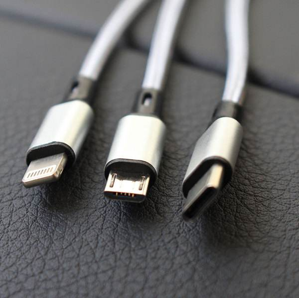
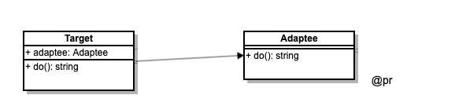

# 为什么使用适配器模式
项目经过多个版本迭代后，容易产生多对象（接口）兼容问题，即多对象协同工作，而直接修改原对象会又不方便（会引发要修改更多的业务代码），这时可考虑用适配器封装，以便外部调用者统一使用。

# 定义
将一个类（对象）的接口（方法或属性）转化成使用者希望的另外一个接口（方法或属性），使得原接口不兼容的类（对象）可以正常使用。【即为兼容而派生的 “转换器”】。


# 生活用例


# 实现
在不改变原有对象接口的基础上，定义一个包装对象，新对象调用原有接口，使外部调用者可以正常使用。

# UML类图


# 代码
```javascript
// 适配器模式
class Adaptee {
    do() {
        return '原始插头';
    }
}

class Target {
    constructor() {
        this.adaptee = new Adaptee();
    }
    do() {
        const info = this.adaptee.do();
        return `可用插头（转换${info}）`
    }
}

const target = new Target();
console.log(target.do());
```

# 场景

## 第三方 SDK 的应用
```js
// 0.4.0/sdk.js
const aMap = {
    show() {
        console.log('渲染高德地图');
    }
};
const baiduMap = {
    display() {
        console.log('渲染百度地图');
    }
};

// 对外都使用 show 方法，建立百度地图适配
const baiduMapAdapter = {
    show() {
        return baiduMap.display();
    }
};

// 外部调用，统一接口调用
const renderMap = map => {
    map.show();
};

renderMap(aMap);
renderMap(baiduMapAdapter);
```

## jQuery 使用
jQuery 封装事件处理的适配器，解决跨浏览器兼容性问题。
```js
// $('selector').on() 实现
const on = (target, event, callbacl) => {
    if(target.addEventListener) {
        // 标准事件监听
        target.addEventListener(event, callback);
    } else if(target.attachEvent) {
        // IE低版本事件监听
        target.attachEvent(event, callback);
    } else {
        // 低版本浏览器事件监听
        target[`on${event}`] = callback;
    }
}
```

## ajax 封装旧接口

```javascript
// 现在封装的方法
request({
  url: '/getData',
  type: 'POST',
  dataType: 'json',
  data: {}
}).done(funciton() { });

// 项目中已有代码
$.ajax({
  // ...
});

// 问题来了，将$.ajax 换成 request，难免会有一些问
// 做一层适配器
const $ = {
  ajax: function(options) {
    return request(options);
  }
}
```

## vue computed
```html
<!DOCTYPE html>
<html lang="en">

<head>
    <meta charset="UTF-8">
    <meta name="viewport" content="width=device-width, initial-scale=1.0">
    <meta http-equiv="X-UA-Compatible" content="ie=edge">
    <title>vue computed</title>
</head>

<body>
    <div id="app">
        <p>顺序：{{message}}</p>
        <p>倒序：{{reversedMessage}}</p>
    </div>
    <script src="https://cdn.bootcss.com/vue/2.5.16/vue.js"></script>
    <script>
        var vm = new Vue({
            el: '#app',
            data: {
                message: '全杭州就你最帅'
            },
            computed: {
                reversedMessage: function () {
                    return this.message.split('').reverse().join('')
                }
            }
        })
    </script>
</body>

</html>
```

# 设计原则验证
- 将旧接口和使用者进行分离（旧接口不做改变）
- 符合开放封闭原则